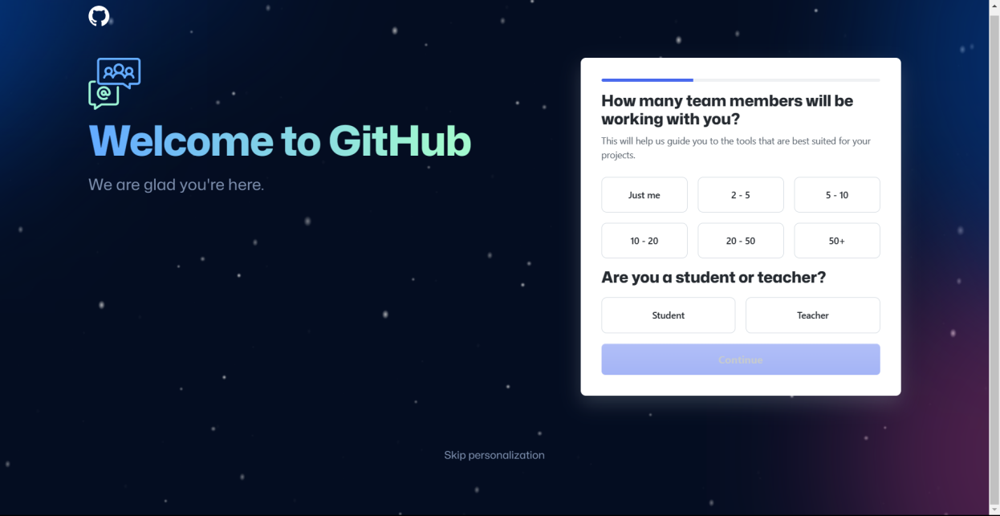

---
authors:
  - Crab55e
tags:
  - management
  - write
  - blog
---

# ブログ記事の書き方解説
まったく何も知らない状態からMet's鯖のブログを書く方法を1から解説します  
全然難しい内容ではないので身構えず読んでいってください

## 必要なもの
- PC(最悪スマホだけでも可)
- メールアドレス

## 大まかな順序
1. [GitHubアカウントを作成する](#GitHubアカウントを作成する)(★★☆☆☆)
2. [プロフィールを設定する](#プロフィールを設定する)(★☆☆☆☆)
3. [Mets-orgに参加する](#Mets-orgに参加する)(★★☆☆☆)
4. [用語について理解する](#用語について理解する)
5. [著者の一人として登録する](#著者の一人として登録する)(★☆☆☆☆)
6. [基本的な構文を覚える](基本的な構文を覚える)(★★☆☆☆)
7. 投稿する(★★☆☆☆)
###### ★ むずかしさ

## GitHubアカウントを作成する

### GitHubとは
GitHubとは世界中の開発者が集まってコードやプログラムを共有するSNSです  
GitHubにはコードを管理するために便利な仕組みがたくさんあり、そのほかにも色々な機能があります  
それらの機能を使ってブログページの管理や公開をしています

### GitHubアカウントを作成する
次の手順を踏み、GitHubのアカウントを作成します  
既にGitHubのアカウントを持っている人はこの手順を飛ばして、

### GitHubのページを開く
[ここからGitHub](//github.com)を開いて、"Sign up"を押します  

<!-- githubのトップページ画像、多分パス修正が必要 -->

### 情報を入力する
メールアドレスや、パスワードなどを入力して認証を受ける  
  
**Enter your email**にはメールアドレスを  
**Create a password**にはパスワードを  
**Enter a username**にはユーザー名を入力します  
その下の  
「Would you like to receive product updates and announcements via email?
Type "y" for yes or "n" for no」  
はGitHubからのアップデートやアナウンスなどの情報をメールで受け取るかどうかを"yes(y) or no(n)"で入力します  
ロボット認証が終わったら、**Create account**を押します　　
そうすると、設定したメールアドレスに認証コードが送られます　　
そのコードを入力するとアカウントを作成出来ます　　
そしたら、次の手順に移りましょう

## プロフィールを設定する
プロフィールを設定します、アカウントのアイコン画像などを用意しておいてください  
  
最初の画面はこんな感じになります、これはユーザーに合わせてgithubの設定を変えていくものなんですが  
スキップできるので今回は下にうっすらある**Skip personalization**を押しましょう
そうするときれいな景色が見えてきます(一瞬)、そしてGitHubアカウントの作成は完了です  
そしたらさっそくプロフィールを設定しましょう  
[https://github.com/settings/profile](https://github.com/settings/profile)に進んでいい感じにしといてください

## Mets-orgに参加する
Mets-orgに参加します、Mets-orgとはGitHub上にあるMet's サーバーのグループです  
Mets-orgにはMet's サーバーにいる何人かの開発者やブログの著者などが集まっています  
具体的には次のような手順で参加します

### 招待を送ってもらう
Mets-orgの管理者に招待を送ってもらいます
Discordのチケットや会話チャンネルなどでお願いしてみましょう

### 承認する
実はここら辺あんま覚えてないんですよね...  
GitHubにある[Mets-org](https://github.com/Mets-org)のページとか見たら横にJoinやAcceptみたいなボタンがあるかもしれません...  
探してみてください
もしどうしても見つからなかったらDiscordで誰かにヘルプを求めましょう
ちなみにこの手順を終えることで、あなたはMets-orgのファイルなどを変更する権限を得られます

## 用語について理解する
説明や記事を書くうえで理解しておくべき最低限の用語について解説します  
この欄の最後にちょっと上級な用語も解説します

| 用語の名前     | 読み                | 説明 |
| ---------------| ------------------ | ---- |
| Repository     | リポジトリ                | GitHubではプロジェクトをRepositoryという単位で表します、ブログや利用規約をまとめてあるこのプロジェクトは、www.mets-svr.com という名前のリポジトリですね |
| Commit         | コミット                  | ファイルやフォルダなどの構造への変更をGitHub上に登録し、反映することです |
| Issue          | イシュー                  | リポジトリに対してバグや改善点などの報告を行う事 |
| Pull request   | プルリクエスト             | [Pull requests](https://github.com/Mets-org/www.mets-svr.com/pulls)欄などから作成する、既存のリポジトリ(プロジェクト)に対して変更を反映してください！っていうリクエスト
| Organization   | オルガナイゼーション(多分) | 上のほうでも話した通り、複数のメンバーからなる開発組織、グループ |
例文:
- 「mets鯖のOrganizationのリポジトリに豚の調理方法についての新しいブログ記事をコミットする」
- 「美味しいスルメの作り方についての記事を作ったので、mets鯖のブログに入れてほしい、よし！プルリクエストを送ろう！」
- 「昨日書いた豚の調理方法についての記事にミスがあった、今すぐ修正するのはめんどくさいからとりあえずIssueを出しておこう」

ここからたまに役に立つかもしれない上級用語
| 用語の名前       | 読み               | 説明 |
| Markdown         | マークダウン       | 簡単に文字の大きさやスタイルなどを変えられる表記方法 |
| Contributer      | コントリビューター | リポジトリやその内容の作成について関わった人や、その権限を持つ人 |
| Deploy           | デプロイ           | 変更したデータを実際に使う場所に設置すること（ここでは主に変更した記事がwebサイトに反映されることを表します） |
| Static / Dynamic | 静的 / 動的        | コンテンツがユーザーの操作などに応じて変更されるかどうか（ここら辺ちょっと感覚をつかむのが難しい） |

## 著者の一人として登録する
[authors.yml](https://github.com/Mets-org/www.mets-svr.com/blob/main/blog/authors.yml)から自分をを著者の一覧に追加します  
具体的には以下のようにプロフィールを記述します  
```yaml
<MCID>:
   name: <表示名>
   title: <簡単な自己紹介>
   url: <SNSなどのリンク>
   image_url: <プロフィール画像のリンク>
   email: <任意>
```
プロフィール画像のリンクはimgurなどのサービスを利用するか、mets-svr.comで提供します
emailの部分を設定したくない場合は、そのラインを削除して使ってください
MCIDの部分は、あとで使います

## 基本的な構文を覚える
いよいよやってきましたね！  
記事を書く時！！！  
記事を書く際には、マークダウンというものを使用します  
マークダウンとは、文や表、画像、リンクなどを**簡単にわかりやすく**記述する方法です  
マークダウンについては既に分かりやすい記事があるのでそちらを読んでみてください  
> [Markdown記法・GitHub Gist](https://gist.github.com/mignonstyle/083c9e1651d7734f84c99b8cf49d57fa)

ちなみに実はこれとプラスでちょっと覚えるべきものがあります  
それが、基本的な構文です  
ブログを書く際は次のように書いて、その下に記事の内容を書いていきます
```md
---
authors:
- MCID
tags:
- blog
---

# タイトル
```
こんな感じです、簡単でしょう？  
さっき言っていたMCIDをあそこに書きます
その下にタグを書きます、その記事がどんなカテゴリにものなのか定義しましょう
ちなみに、複数の人と記事を書く場合は
```md
---
authors:
- MCID
- MCID1
tags:
- blog
- collaboration
---

# タイトル
```
などと書きます、タグの場合も同様です

## 投稿する
さて！あなたが頑張って、時間をかけて作成した最初の記事を投稿  
記事の投稿方法はいたってシンプル、所定の場所にマークダウンファイルを置き、内容をコミットするだけ！コミット
コミットするときはメッセージを入力しましょう**Commit new file**の欄の、すぐ下のテキストボックス  
"Create ○○.md"のところに変更内容を簡潔に表しましょう  
もし、詳細な情報を明示する必要があるならばその下の欄に書きましょう！

これであなたもブロガー！

# さいごに
お疲れさまでした、以上で"ブログの書き方解説"は終わりとなります  
不明な点などがあれば気軽に、無くてもDM荒らしにDiscordなどで僕のDMに遊びに来てください　　
これからの投稿される、あなたの素晴らしい記事！楽しみに待っていますよ　　
では、ありがとうございました　　
